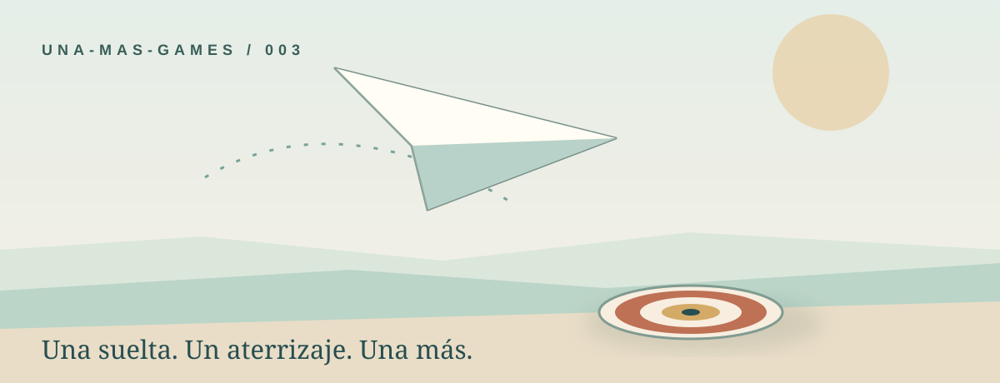

<div align="center">



# El aterrizaje perfecto

**Un avión de papel. Una sola suelta. ¿Puedes aterrizar en el centro?**

[](https://goyoaga.github.io/el-aterrizaje-perfecto/)


</div>

---

## El reto

El avioncito cruza la escena. La diana espera en el suelo. **Toca una vez para soltarlo** cuando creas que aterrizará en el centro. La brisa es visible y se mantiene constante durante cada intento. El resultado muestra la distancia al centro y tu mejor marca.

<div align="center">

**OBSERVA LA BRISA** &nbsp; → &nbsp; **SUELTA EL AVIÓN** &nbsp; → &nbsp; **MIRA DÓNDE CAE** &nbsp; → &nbsp; **UNA MÁS**

</div>

| Elemento | Regla |
| :--- | :--- |
| Control | Toca la escena o «Soltar avión»; también sirve el clic o la barra espaciadora. |
| Un intento | Tras soltarlo no hay ajustes en pleno vuelo. Puedes esperar tantos pasos como quieras antes de decidir. |
| Brisa | Calma, izquierda o derecha. Nunca cambia durante el vuelo. |
| Resultado | Distancia horizontal al centro, en centímetros de la pista virtual. |
| Premio | **Menos de 10 cm**: «¡Aterrizaje perfecto!» y confeti breve. |
| Récord | Se guarda en este navegador; el juego sigue funcionando si el almacenamiento está bloqueado. |

La escena tiene apariencia **pseudo-3D** mediante capas, perspectiva ilustrada, pliegues y sombras. La posición de aterrizaje y la puntuación se calculan sobre el mismo eje horizontal. La pista virtual conserva la misma escala en móvil y escritorio.

## Hecho para una pausa

- Una ronda dura aproximadamente 15–30 segundos, según cuánto esperes para soltar.
- En móvil, el botón principal permanece al alcance en la parte inferior; también puedes tocar la escena.
- El sonido comienza **OFF en cada visita**. Al activarlo, Cuelume reproduce señales breves; no necesitas audio para entender o jugar.
- Con la preferencia de movimiento reducido se omite el confeti animado y se mantiene el mensaje del logro.
- El botón ☆ explica cómo guardar el enlace en favoritos. El navegador debe confirmar el marcador.
- Gratis, sin cuentas, publicidad, ranking global ni servidor del juego.

## Jugar

**[Abrir El aterrizaje perfecto](https://goyoaga.github.io/el-aterrizaje-perfecto/)**

## Ejecutar en local

Requiere Node.js 22 o superior y npm:

```bash
npm ci
npm run dev
```

Vite mostrará la URL local. Para verificar la mecánica y la compilación:

```bash
npm test
npm run build
npm run preview
```

**Vite se usa realmente** para el entorno local y el build estático. El código de la escena está en `src/main.js`; las reglas y el cálculo en `src/model.js`. GitHub Actions compila `dist` y lo despliega en GitHub Pages con la ruta base `/el-aterrizaje-perfecto/`.

## Cómo se calcula

La pista tiene **1.000 cm virtuales** de ancho. En un vuelo, el avión avanza durante 1,15 segundos con velocidad horizontal fija y un pequeño efecto de brisa: `x_final = x_suelta + (220 + brisa) × 1,15`. La diferencia es `|x_final − centro|`.

La posición dibujada en el último fotograma y el número del resultado utilizan esa misma fórmula. Los centímetros son una escala del juego, no una medición física del tamaño de tu pantalla.

## Analítica y apoyo

[GoatCounter](https://www.goatcounter.com/) registra las visitas a la página y el evento «ronda-completada», sin incluir la puntuación individual. Un bloqueador puede impedir esa medición sin afectar la partida.

¿Te divertiste? [Invítame un café en Ko-fi ☕](https://ko-fi.com/arielgoyoaga). La aportación es voluntaria y el juego siempre será gratuito.

---

<div align="center">

Hecho para **UNAMAS GAMES** · una partida más y seguimos.

</div>
